## 商品价格比较网站-设计报告

### 一、项目背景

    本项目是2024-2025秋冬学期《B/S体系软件设计》的课程项目，旨在设计一个商品价格比较网站，要求实现用户注册、登录功能，注册时需要填写必要信息以验证；用户登陆后通过商品名称在主流电商平台（至少2个以上）上查询该商品实时价格；建立商品库并保存；提供商品查询界面并分析商品历史价格；支持降价提醒（邮件或APP推送方式）；并且要求样式适配手机，开发对应手机APP或能够在内置浏览器中友好显示。同时也需要提供必要的软件项目文档，使自己了解并掌握一套web应用开发技术和开发的总体流程。

    本文档是该项目的系统设计文档，包含了系统的需求分析，系统的总体架构设计，以及数据库的设计和系统接口、界面原型的设计等内容，详细介绍了物联网设备应用网站的设计情况。

    该项目需要包含完整的web前后端，对应部署服务器，以及相关项目文档等内容，并且由一人独立完成。

### 二、系统需求分析

#### 2.1 功能性需求分析

    该项目主要是一个B/S架构的web应用，对于每个用户需要实现如下功能性需求：

- 用户注册（需要用户名、密码、手机号、邮箱等关键信息）
- 用户登录
- 用户信息修改
- 用户通过商品名称查询商品实时价格
- 用户通过商品名称查询商品历史价格分析
- 用户通过设置降价提醒能够获取定时的降价发送提醒

  该系统的主要用户为普通用户与管理员，普通用户可以通过用户接口对该系统的一系列功能进行使用；管理员需要定期维护系统的所有信息（包括商品的历史信息与实时信息）。

  因此，该项目的功能性需求主要可分为两个模块，一个是用户信息模块，另一个是商品管理模块。这些功能性需求的关系和模块划分图可表示为：

其中每个功能还有若干子功能，例如用户注册包括邮箱绑定、账号密码保密性限制；用户信息修改包括通过邮箱找回密码、更改账号名等功能；历史价格查询包括对不同时间点的价格图表与分析结果等等。

#### 2.2 非功能性需求分析

该系统的 非功能性需求包括性能需求，输入输出需求，数据管理需求等，具体的要求如下：

##### 2.2.1 性能需求

- 系统应保证运行稳定，避免出现崩溃；
- 当前主流浏览器均能正常访问本系统；
- 系统应能保证至少100人的并发访问；
- 当用户登录以及进行任何操作时，系统应该能及时进行反应，反应的时间在1s以内；
- 系统应该能及时检测出各种非正常情况，如与设备的通信中断断开，无法连接数据库服务系统应该能及时检测出各种非正常情况，避免用户长时间等待；
- 每个页面一般情况下应在1s内加载完毕，高峰期应在5s内加载完毕；
- 系统保证在一周内不超过一次维护与重启。

##### 2.2.2 输入输出需求

- 在用户输入账号密码时，应对数据输入进行数据有效性检查，同时应该确保其安全性；
- 商品的历史价格走向等信息必须以可视化的图标等方式呈现，需要美观而准确显示数据库中的数据；
- 此外，系统应通过程序控制出错几率，减少系统因用户人为的错误引起的破坏，开发者应当尽量周全地考虑到各种可能发生的问题，使出错的可能降至最小。

##### 2.2.3 数据管理需求

- 系统既要与其他系统有接口，又必须保证本系统的独立性与完整性。即应防止未经授权的各类人员对本系统进行设置和修改或访问系统内部数据。
- 系统服务器软件必须提供可靠的数据备份和恢复手段，在服务器软件或硬件出现严重故障时，能够根据备份的数据和账户信息迅速恢复正常运行环境。同时，软件开发者不得在系统中预留任何特殊账户和密码，保证其安全性。
- 除此之外，系统应具备加密登录、数据加密传输等安全方面的保障，保证数据在不用系统间传输过程中的保密性与安全性。

##### 2.3 条件与限制

- 服务器运行环境限制：
  - 操作系统：Windows10或以上版本，或Linux系统；
  - 硬件配置：具备4核CPU、8GB内存及以上；
  - 软件环境：
    - Web服务器：使用Nginx 1.10或以上版本作为Web服务器；
    - 前端框架：使用React 18.3或以上的版本，以及对应版本的React-dom、React-router-dom等库；
    - 后端框架：使用Spring Boot 2.6或以上版本，以及对应版本的Spring Data JPA等库；
    - 数据库：使用MySQL 8.0或以上版本，并配置好相应的数据库连接；
  - 网络环境：使用HTTP协议对系统进行传输
- 开发过程代码规范限制：
  - 代码风格：遵循Google Java编程规范，使用Intellij IDEA或VScode等IDE进行开发；
  - 避免使用过时、不安全的技术：尽量使用最新的技术，避免使用过时的技术，如使用过时的Spring版本等；
  - 代码注释：代码中需要添加详细的注释，方便其他开发者阅读和理解；
  - 严格控制代码质量，避免出现内存泄漏、缓冲区溢出、SQL注入等安全漏洞；
  - 采用版本控制工具：如Git等，方便团队协作开发。

### 三、系统技术选型

#### 3.1 项目技术选型

本项目采用前后端分离的开发模式，前端采用HTML、CSS、JavaScript等技术，后端采用Java、Spring、MySQL等技术。前端负责页面的呈现，后端负责数据的处理与存储。

#### 3.2 项目主要技术介绍

##### 3.2.1 前端技术框架

本项目前端采用React+Antd+npm包管理工具作为主体框架：

1. React: React 是由 Facebook 开发并开源的一个用于构建用户界面的 JavaScript 库，特别适用于构建单页应用（SPA）。它主要负责视图层的渲染，提供了一种高效更新用户界面的方式。它具备组件化、声明式、虚拟DOM、单向数据流、JSX语法等特性，可以帮助开发者快速开发出高质量的产品。
2. Antd: Ant Design（简称 Antd）是由阿里巴巴推出的企业级 UI 设计语言和 React 组件库，主要用于构建复杂的、数据密集型的企业级应用。它提供了一套完整的设计规范和丰富的 UI 组件，帮助开发者快速创建高质量的 Web 应用。Antd具备丰富的组件库、一致的设计语言、响应式设计、国际化支持、按需加载等特点，特别适合企业级应用和管理系统的开发。
3. npm包管理工具: npm（Node Package Manager）是Node.js的默认包管理工具，用于管理JavaScript代码库和项目依赖。它为开发者提供了以下功能：

- 包管理：npm允许开发者轻松地安装、更新和删除项目的依赖包。它支持一个庞大的开源包库，开发者可以通过npm下载和使用现成的工具和库。
- 依赖管理：npm通过 `package.json`文件记录项目的依赖，确保所有开发者和部署环境都能使用相同的版本。开发者可以使用 `npm install`来自动安装这些依赖。

##### 3.2.2 后端技术框架

本项目后端采用Spring boot +  Spring Data JPA作为主体框架，同时采用MySQL作为数据库：

1. Spring boot：Spring Boot是由Pivotal团队提供的全新框架，其设计目的是用来简化新Spring应用的初始搭建以及开发过程。该框架使用了特定的方式来进行配置，从而使开发人员不再需要定义样板化的XML文件。Spring Boot 以其简化配置、快速开发、灵活扩展的特性，成为 Java 后端开发的主流选择之一，广泛应用于微服务、企业级应用和 Web 开发。
2. Spring Data JPA：Spring Data JPA 是 Spring Data 项目下的一个子模块，专门用于简化与 JPA（Java Persistence API） 数据访问层的集成。它为基于 JPA 的持久化提供了高级抽象，减少了重复代码，并使开发者能够更加便捷地进行数据库操作。Spring Data JPA 极大地减少了与数据库交互时的模板代码，使开发者专注于业务逻辑的实现，提高了开发效率。它特别适合快速开发数据驱动的应用。
3. MySQL：MySQL 是一个开源的关系型数据库管理系统（RDBMS），广泛用于Web应用、数据分析等领域。它以其高性能、可靠性和易用性成为全球最流行的数据库之一。MySQL 以其高效、可靠和易用的特性，成为小型到中大型应用的数据库首选，特别适合 Web 开发和数据驱动的应用程序。

### 四、系统架构设计

#### 4.1 系统总体架构图

本系统采用经典的B/S架构，前端负责页面的呈现，后端负责数据的处理与存储。系统的总体架构图如下：

#### 4.2 前端架构图

本系统前端采用React+Antd+npm包管理工具作为主体框架，前端架构图如下：

#### 4.3 后端架构图

本系统后端采用Spring框架的经典三层架构（Controller、Service、Dao），Dao层负责与数据库的交互，Service层负责业务逻辑的处理，Controller层负责处理请求并返回响应。后端架构图如下：

#### 4.4 功能IPO图

本系统功能IPO图如下：

1. 用户注册：

2. 用户重置密码：

3. 查询商品：

4. 设置降价提醒：

5. 取消降价提醒：

#### 4.5 用例图

本系统用例图如下：

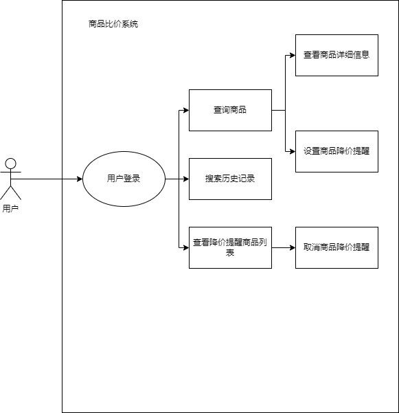

### 五、数据库设计与E-R图

#### 5.1 概念结构设计

##### 5.1.1 用户表

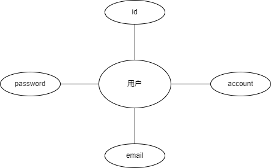

##### 5.1.2 商品表

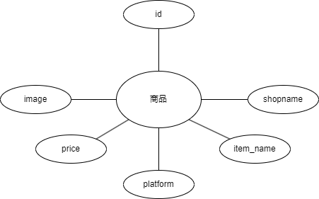

##### 5.1.3 搜索历史表

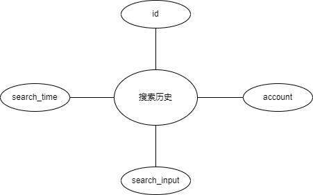

##### 5.1.4 降价提醒设置表

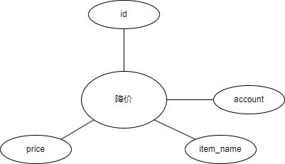

##### 5.1.5 E-R图

本项目的E-R图如下：

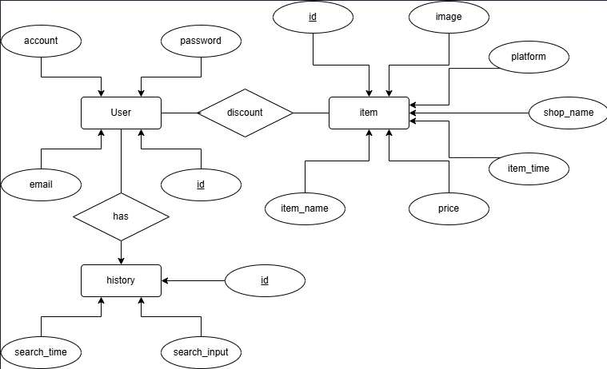

#### 5.2 逻辑结构设计

- 用户表：

User(id, account, password, email)

- 商品表：

Item(id, item_name, price, item_time, platform, image, shop_name)

- 搜索历史表：

History(id, account, search_input, search_time)

- 降价提醒设置表：

Discount(id, account, item_name, price)

#### 5.3 数据表设计

    本项目的数据库共设计4个数据表，分别用于存储用户信息、商品信息、搜索历史、降价提醒设置，具体的表结构设计情况如下：

##### 5.3.1 user表

- 该表用于保存用户的信息：

|  字段名  |     类型     |   描述   |       备注       |
| :------: | :----------: | :------: | :--------------: |
|    id    |     int     | 用户的id | 主键，非空，自增 |
| account | varchar(128) |  用户名  |   非空，unique   |
| password | varchar(128) | 用户密码 |       非空       |
|  email  | varchar(128) |   邮箱   |   非空，unique   |

##### 5.3.2 item表

- 该表用于保存商品的信息：

|  字段名  |     类型     |     描述     |       备注       |
| :-------: | :----------: | :----------: | :--------------: |
|    id    |     int     |   商品的id   | 主键，非空，自增 |
| item_name | varchar(512) |   商品名称   |       非空       |
|   price   |    double    |   商品价格   |       非空       |
| item_time |   datetime   | 商品更新时间 |       非空       |
| platform | varchar(128) | 商品来源平台 |       非空       |
|   image   | varchar(512) | 商品图片地址 |                  |
| shop_name | varchar(512) | 所属商家名称 |                  |

##### 5.3.3 history表

- 该表用于保存用户对商品的搜索历史：

|    字段名    |     类型     |     描述     |       备注       |
| :----------: | :----------: | :----------: | :--------------: |
|      id      |     int     | 搜索历史的id | 主键，非空，自增 |
|   account   | varchar(128) |    用户名    |       非空       |
| search_input | varchar(128) |   搜索内容   |       非空       |
| search_time |   datetime   |   搜索时间   |       非空       |

##### 5.3.4 discount表

- 该表用于保存降价提醒的设置：

|  字段名  |     类型     |     描述     |       备注       |
| :-------: | :----------: | :----------: | :--------------: |
|    id    |     int     | 降价提醒的id | 主键，非空，自增 |
|  account  | varchar(128) |    用户名    |       非空       |
| item_name | varchar(512) |   商品名称   |       非空       |
|   price   |    double    | 商品最新价格 |       非空       |

### 六、系统接口设计

#### 6.1 用户信息相关外部接口

##### 6.1.1 用户登录

|   项目   |          内容          |
| :------: | :--------------------: |
|   URL   |      /user/login      |
| 请求方式 |          POST          |
| 请求参数 |   account、password   |
| 返回参数 | token(若成功)、message |

简介：用户登录接口，用于验证用户的账号密码。根据不同情况有以下处理结果：

|     情况     |                  返回值                  |
| :----------: | :--------------------------------------: |
|  账号不存在  |        message: “用户不存在”；        |
|   密码错误   |         message: “密码错误”；         |
| 账号密码正确 | token，message: “login successfully”。 |

##### 6.1.2 用户注册

|   项目   |                   内容                   |
| :------: | :---------------------------------------: |
|   URL   |              /user/register              |
| 请求方式 |                   POST                   |
| 请求参数 | account、password、email、code、jwt_value |
| 返回参数 |                  message                  |

简介：用户注册接口，用于用户注册。根据不同情况有以下处理结果：

|        情况        |                返回值                |
| :----------------: | :----------------------------------: |
|     账号已存在     |      message: “账号已存在”；      |
|     邮箱已存在     |      message: “邮箱已存在”；      |
| 账号格式不符合要求 |      message: “帐户名过短”；      |
| 密码格式不符合要求 |       message: “密码过短”；       |
| 邮箱格式不符合要求 |     message: “邮箱格式有误”；     |
|    jwt解析失败    |     message: “验证码已失效”；     |
|     验证码错误     |      message: “验证码错误”；      |
|  并非以上所有情况  | message: “register successfully”； |

##### 6.1.3 发送验证码

|   项目   |       内容       |
| :------: | :--------------: |
|   URL   | /user/send_email |
| 请求方式 |       GET       |
| 请求参数 |      email      |
| 返回参数 |     message     |

简介：发送验证码接口，用于用户注册时发送验证码到邮箱。根据不同情况有以下处理结果：

|      情况      |            返回值            |
| :------------: | :---------------------------: |
|   邮箱不存在   |   message: “邮箱不存在”；   |
| 验证码发送成功 | message: “验证码发送成功”； |

##### 6.1.4 重置密码

|   项目   |                    内容                    |
| :------: | :----------------------------------------: |
|   URL   |            /user/reset_password            |
| 请求方式 |                    POST                    |
| 请求参数 | account、password、 email、code、jwt_value |
| 返回参数 |                  message                  |

简介：重置密码接口，用于用户忘记密码时重置密码。根据不同情况有以下处理结果：

|        情况        |              返回值              |
| :----------------: | :-------------------------------: |
|     账号不存在     |     message: “用户不存在”；     |
| 邮箱与帐户名不匹配 | message: “邮箱与帐户名不匹配”； |
|    jwt解析失败    |    message: “验证码已失效”；    |
|     验证码错误     |     message: “验证码错误”；     |
| 密码格式不符合要求 |      message: “密码过短”；      |
|    密码重置成功    | message: “reset successfully”； |

#### 6.2 商品信息相关外部接口

##### 6.2.1 商品实时查询

|   项目   |           内容           |
| :------: | :----------------------: |
|   URL   |       /item/insert       |
| 请求方式 |           GET           |
| 请求参数 |          input          |
| 返回参数 | items(商品列表)，message |

简介：商品实时价格查询接口，用于查询商品的实时价格。根据不同情况有以下处理结果：

|      情况      |                    返回值                    |
| :------------: | :------------------------------------------: |
| 在某个爬虫失败 | items: []； message: “fail on xxxspider”； |
|  正常查询成功  |       items； message: “查询成功”；       |

##### 6.2.2 商品价格趋势查询

|   项目   |      内容      |
| :------: | :-------------: |
|   URL   |    /item/get    |
| 请求方式 |       GET       |
| 请求参数 |      name      |
| 返回参数 | item[], message |

简介：商品价格趋势查询接口，用于查询数据库中关于该商品在不同时间下的价格情况并返回，由前端进行趋势图的构建与分析。根据不同情况有以下处理结果：

|     情况     |             返回值             |
| :----------: | :----------------------------: |
| 正常查询成功 | items; message: “查询成功”； |

#### 6.3 用户搜索历史相关外部接口

##### 6.3.1 插入用户搜索历史

|   项目   |       内容       |
| :------: | :--------------: |
|   URL   | /history/insert |
| 请求方式 |       POST       |
| 请求参数 | jwt_value, input |
| 返回参数 |     message     |

简介：用户在搜索时自动调用的后端接口；将用户搜索的内容记录在数据库中。

|     情况     |            返回值            |
| :----------: | :--------------------------: |
| jwt解析失败 | message: “invalid token”； |
| 正常插入成功 |   message: “插入成功”；   |

##### 6.3.2 获取用户搜索历史

|   项目   |        内容        |
| :------: | :----------------: |
|   URL   |    /history/get    |
| 请求方式 |        GET        |
| 请求参数 |     jwt_value     |
| 返回参数 | history[], message |

简介：用户获取搜索历史接口，用于获取用户的搜索历史。根据不同情况有以下处理结果：

|     情况     |               返回值               |
| :----------: | :--------------------------------: |
| jwt解析失败 |    message: “invalid token”；    |
| 正常查询成功 | history[]; message: “查询成功”； |

#### 6.4 降价提醒相关外部接口

##### 6.4.1 设置降价提醒

|   项目   |            内容            |
| :------: | :-------------------------: |
|   URL   |        /discount/set        |
| 请求方式 |            POST            |
| 请求参数 | jwt_value, item_name, price |
| 返回参数 |           message           |

简介：用户设置降价提醒接口，用于设置降价提醒。根据不同情况有以下处理结果：

|     情况     |            返回值            |
| :----------: | :--------------------------: |
| jwt解析失败 | message: “invalid token”； |
| 正常插入成功 |   message: “插入成功”；   |

##### 6.4.2 获取降价信息并提醒

|   项目   |         内容         |
| :------: | :------------------: |
|   URL   |    /discount/get    |
| 请求方式 |         GET         |
| 请求参数 |      jwt_value      |
| 返回参数 | discounts[], message |

简介：用户获取降价提醒接口，用于获取用户的降价提醒。根据不同情况有以下处理结果：

|     情况     |            返回值            |
| :----------: | :--------------------------: |
| jwt解析失败 | message: “invalid token”； |
| 正常获取成功 |   message: “获取成功”；   |

##### 6.4.3 删除降价提醒

|   项目   |            内容            |
| :------: | :----------: |
|   URL   | /discount/delete |
| 请求方式 |       POST    |
| 请求参数 | jwt_value, item_name |
| 返回参数 |     message     |

简介：用户删除降价提醒接口，用于删除用户的降价提醒。根据不同情况有以下处理结果：

|     情况     |            返回值            |
| :----------: | :----------: |
| jwt解析失败 | message: “invalid token”； |
| 降价提醒不存在 |   message: “降价提醒不存在”；   |
| 降价提醒删除成功 |   message: “降价提醒删除成功”；   |

#### 6.5 内部接口

##### 6.5.1 用户信息相关内部接口（UserController）

1. 用户登录：`/user/login`

- 输入：
    - `String account`: 账户
    - `String password`: 密码
- 输出：
    - 1. 用户不存在：`APIResponse("用户不存在", 200)`
    - 2. 密码错误：`APIResponse("密码错误", 200)`
    - 3. 登录成功：`APIResponse("login successfully", 200, jwt_value)`

2. 用户注册：`/user/register`

- 输入：
    - `String account`: 账户
    - `String password`: 密码
    - `String email`: 邮箱
    - `String code`: 验证码
    - `String jwt_value`: 用于验证的JWT
- 输出：
    - 1. 账号已存在：`APIResponse("账号已存在", 200)`
    - 2. 邮箱已存在：`APIResponse("邮箱已存在", 200)`
    - 3. 帐户名过短：`APIResponse("帐户名过短", 200)`
    - 4. 密码过短：`APIResponse("密码过短", 200)`
    - 5. 邮箱格式有误：`APIResponse("邮箱格式有误", 200)`
    - 6. 验证码已失效：`APIResponse("验证码已失效", 200)`
    - 7. 验证码错误：`APIResponse("验证码错误", 200)`
    - 8. 注册成功：`APIResponse("register successfully", 200)`

3. 发送验证码：`/user/send_email`

- 输入：
    - `String email`: 邮箱
- 输出：
    - 1. 邮箱不存在：`APIResponse("邮箱不存在", 200)`
    - 2. 验证码发送成功：`APIResponse("验证码发送成功", 200)`

4. 重置密码：`/user/reset_password`

- 输入：
    - `String account`: 账户
    - `String password`: 密码
    - `String email`: 邮箱
    - `String code`: 验证码
    - `String jwt_value`: 用于验证的JWT
- 输出：
    - 1. 用户不存在：`APIResponse("用户不存在", 200)`
    - 2. 邮箱与帐户名不匹配：`APIResponse("邮箱与帐户名不匹配", 200)`
    - 3. 验证码已失效：`APIResponse("验证码已失效", 200)`
    - 4. 验证码错误：`APIResponse("验证码错误", 200)`
    - 5. 密码过短：`APIResponse("密码过短", 200)`
    - 6. 密码重置成功：`APIResponse("reset successfully", 200)`

##### 6.5.2 商品信息相关内部接口（ItemController）

1. 商品实时查询：`/item/insert`

- 输入：
    - `String input`: 用户输入的商品名称
- 输出：
    - 1. 在某个爬虫失败：`APIResponse("fail on xxxspider", 200, items)`
    - 2. 正常查询成功：`APIResponse("查询成功", 200, items)`

2. 商品价格趋势查询：`/item/get`

- 输入：
    - `String name`: 商品名称
- 输出：
    - 1. 正常查询成功：`APIResponse("查询成功", 200, items)`

##### 6.5.3 用户搜索历史相关内部接口（HistoryController）

1. 插入用户搜索历史：`/history/insert`

- 输入：
    - `String jwt_value`: 用于验证的JWT
    - `String input`: 用户输入的搜索内容
- 输出：
    - 1. jwt解析失败：`APIResponse("invalid token", 200)`
    - 2. 正常插入成功：`APIResponse("插入成功", 200)`

2. 获取用户搜索历史：`/history/get`

- 输入：
    - `String jwt_value`: 用于验证的JWT
- 输出：
    - 1. jwt解析失败：`APIResponse("invalid token", 200)`
    - 2. 正常查询成功：`APIResponse("查询成功", 200, history)`

##### 6.5.4 降价提醒相关内部接口（DiscountController）

1. 设置降价提醒：`/discount/set`

- 输入：
    - `String jwt_value`: 用于验证的JWT
    - `String item_name`: 商品名称
    - `double price`: 商品最新价格
- 输出：
    - 1. jwt解析失败：`APIResponse("invalid token", 200)`
    - 2. 正常插入成功：`APIResponse("插入成功", 200)`

2. 获取降价信息并提醒：`/discount/get`

- 输入：
    - `String jwt_value`: 用于验证的JWT
- 输出：
    - 1. jwt解析失败：`APIResponse("invalid token", 200)`
    - 2. 正常获取成功：`APIResponse("获取成功", 200, discounts)`

3. 删除降价提醒：`/discount/delete`

- 输入：
    - `String jwt_value`: 用于验证的JWT
    - `String item_name`: 商品名称
- 输出：
    - 1. jwt解析失败：`APIResponse("invalid token", 200)`
    - 2. 降价提醒不存在：`APIResponse("降价提醒不存在", 200)`
    - 3. 降价提醒删除成功：`APIResponse("降价提醒删除成功", 200)`

### 七、系统界面原型

#### 7.1 用户登录界面

##### 7.1.1 登录界面

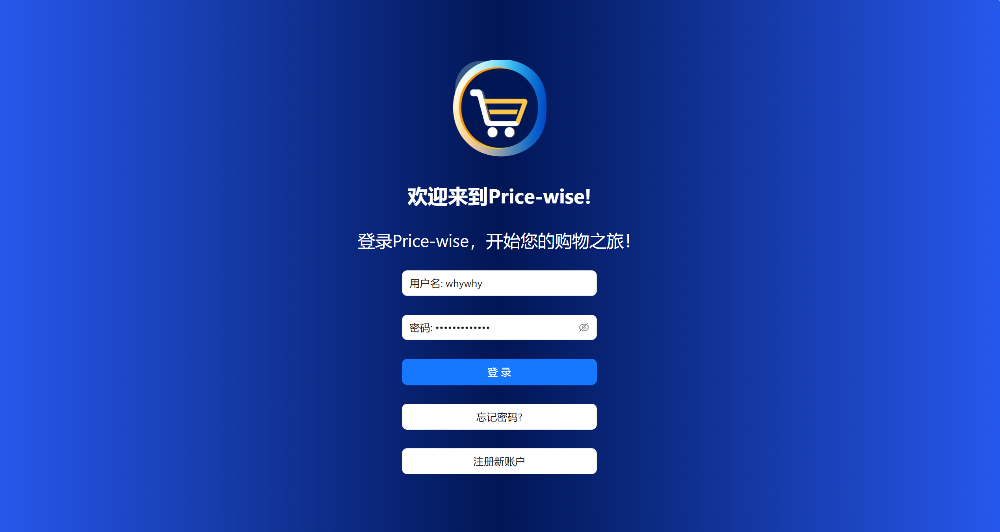

##### 7.1.2 忘记密码界面

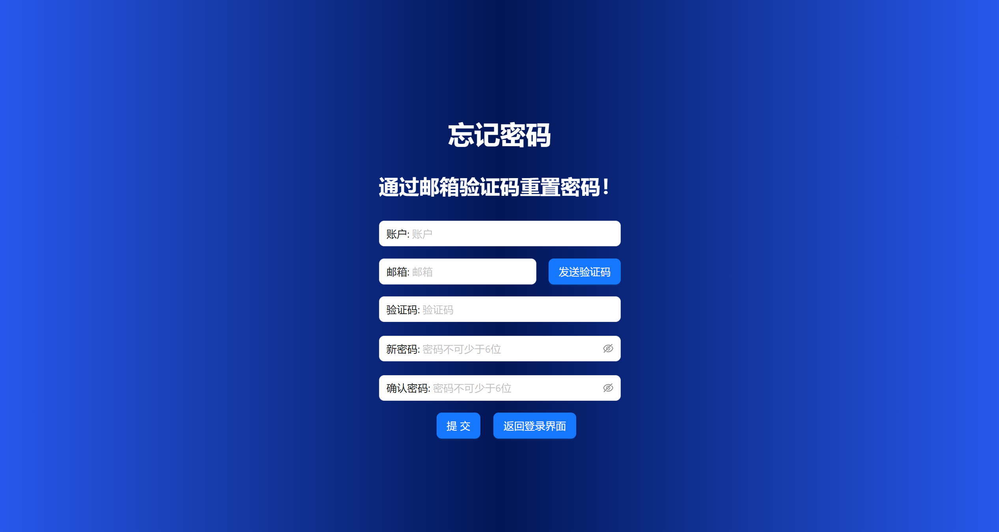

##### 7.1.3 注册界面

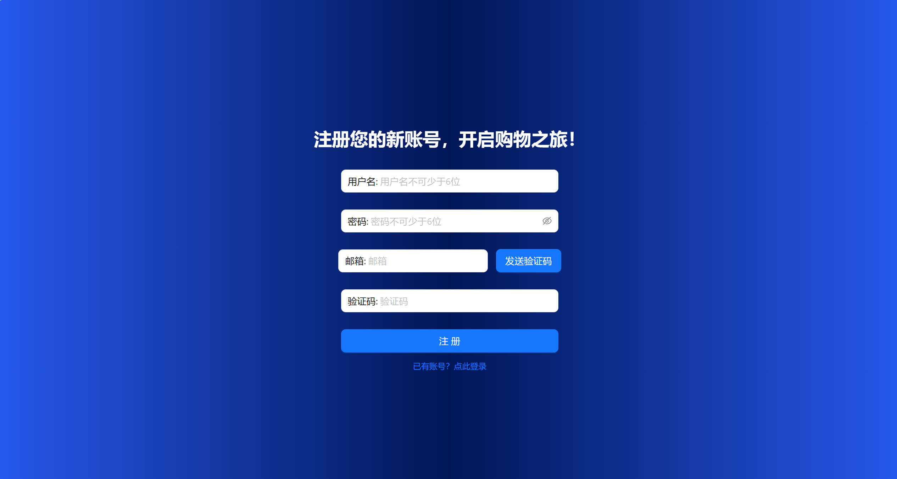

##### 7.1.4 我的关注界面

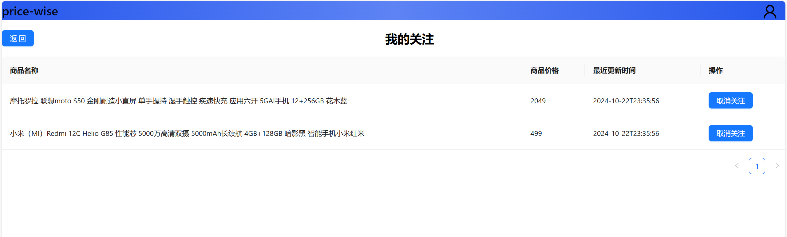

#### 7.2 商品查询/展示界面

##### 7.2.1 商品查询界面

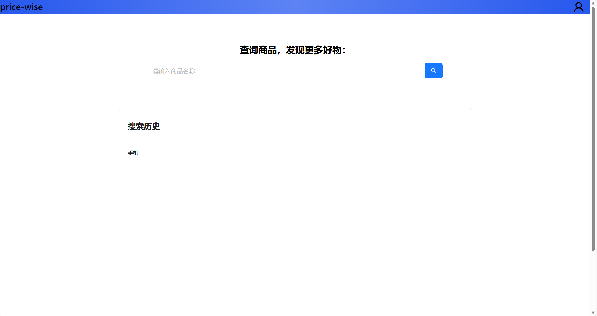

##### 7.2.2 商品展示界面

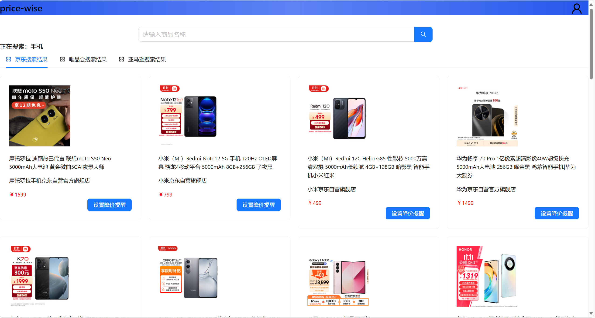

##### 7.2.3 商品详情界面

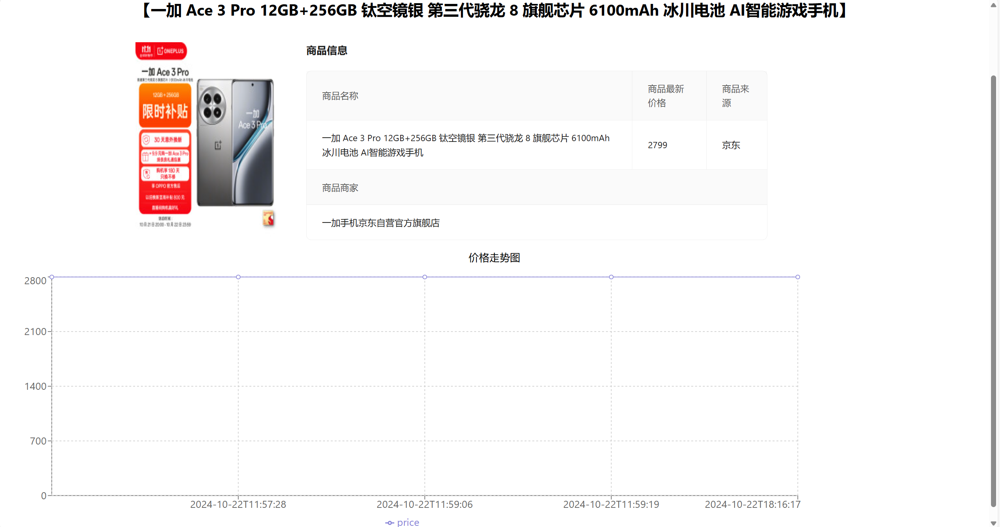

#### 7.3 手机端适配界面

网站应保证在设置为在移动端登录时，也能够正常显示：

##### 7.3.1 手机端登录界面

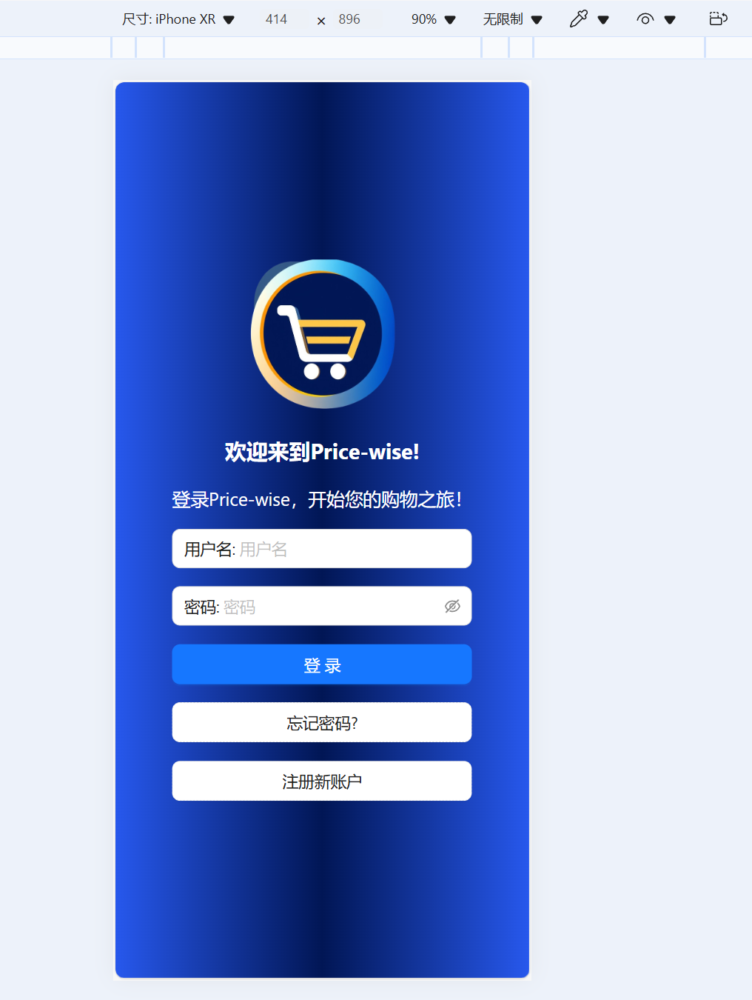

##### 7.3.2 手机端忘记密码界面

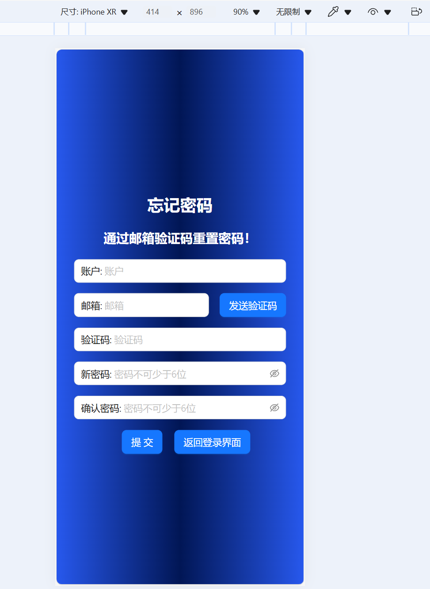

##### 7.3.3 手机端注册界面

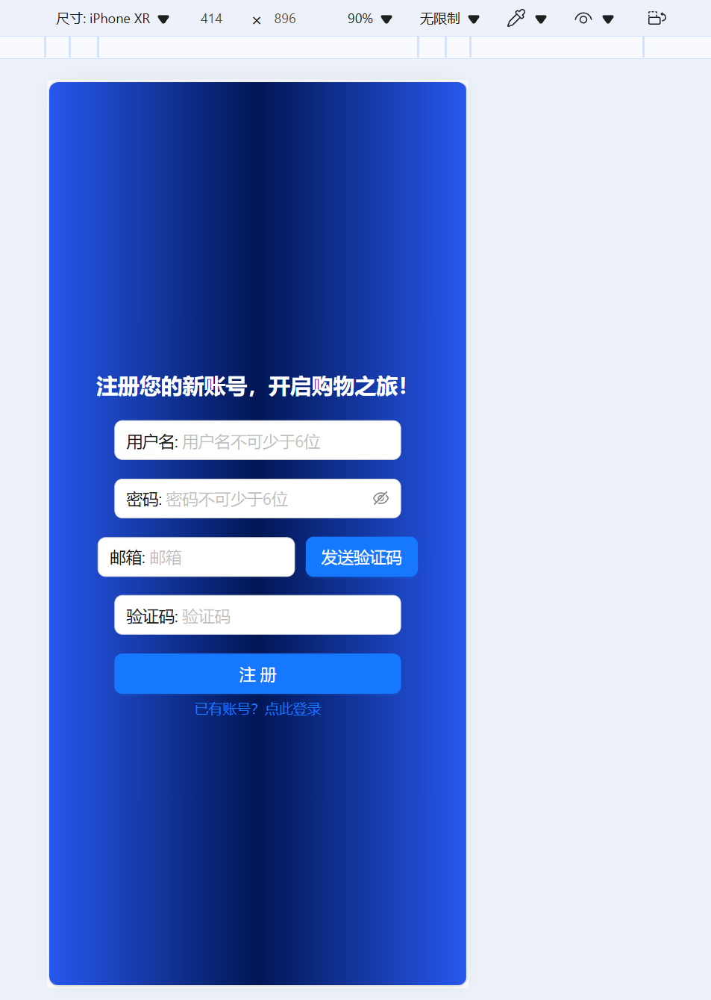

##### 7.3.4 手机端商品查询界面

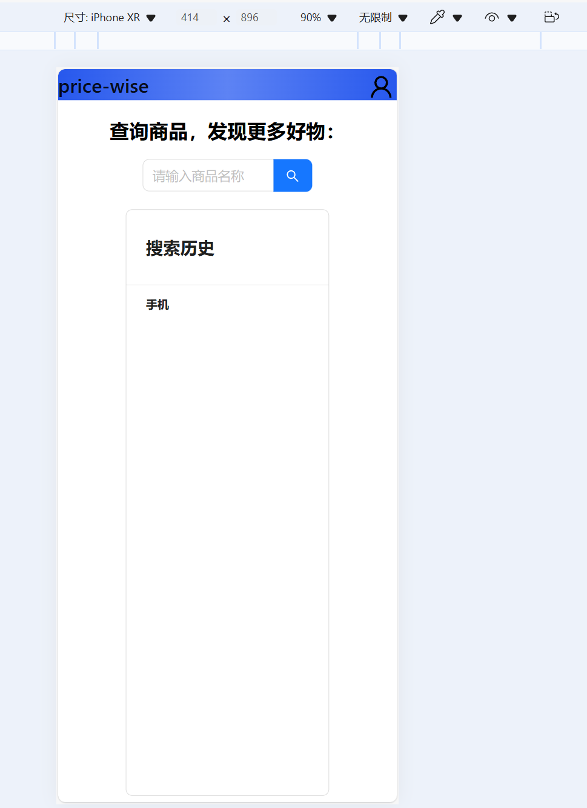

##### 7.3.5 手机端商品展示界面

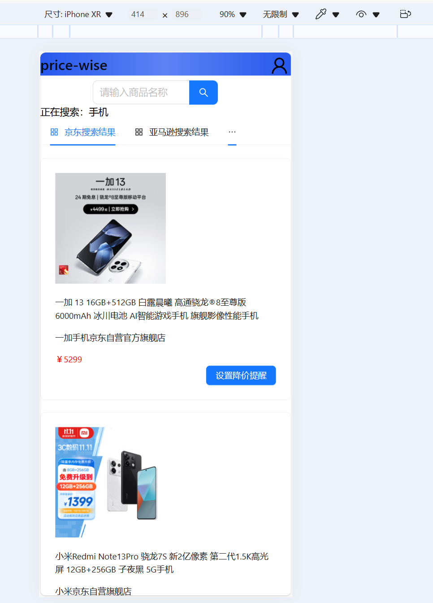

##### 7.3.6 手机端商品关注界面

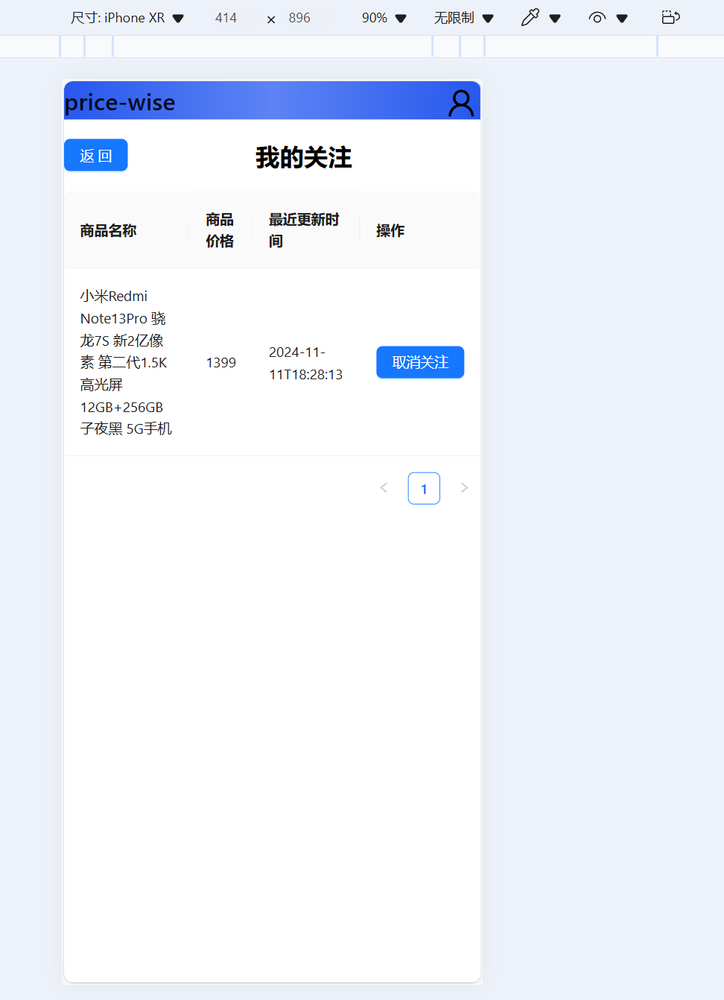

同时，未来开发计划使用React Native开发移动端APP，并打包为apk或IOS安装包形式尝试部署到安卓系统/IOS系统上，完成对应的手机端App开发。

### 八、系统出错设计

#### 8.1 出错信息

1. 数据库无法连接

含义：数据库配置出错、数据库连接数超过上限

处理方法：修改数据库配置、限制并发访问量

2. 服务器无法访问

含义：服务器正在维护中、短时间内有大量流量导致服务器瘫痪

处理方法：联系系统管理员进行紧急处理

3. 无法读取磁盘内容

含义：磁盘受损

处理方法：对磁盘与数据库进行周期性备份

4. 非法访问

含义：部分用户企图访问管理员界面或后台程序，窃取网站

处理方法：限制普通用户越权访问，通过各种手段保护后台数据

5. 数据库执行出错

含义：部分用户企图恶意实施SQL注入

处理方法：使用参数绑定的方法进行SQL语句构建。对用户的输入进行过滤、检查

#### 8.2 补救措施

1. 系统恢复

系统崩溃后，根据系统运行日志恢复系统和数据，并重新启动系统。
2. 定时备份

1. 周期性备份数据库中的数据，定期进行校对、更新，以避免数据损失之后难以找回。
2. 使用Git进行完善的版本管理。
3. 人工操作

当出现紧急情况时，数据库管理员人工对数据库中数据进行修改，并做相应的记录。

#### 8.3 系统维护设计

1. 用户在该系统执行操作时应该留下痕迹，以方便检查系统是否被恶意篡改。同时系统管理员定时查看系统日志，统计非法攻击来源和次数，并针对相应攻击加强安全防范措施。
2. 系统维护人员及时更新技术漏洞，通过各种手段防止各种对系统的攻击，增强代码的可靠性。
3. 定期维护数据库，涉及到检查数据库表、检查日志文件等，确保数据库内数据的正确性。

### 九、附录

#### 9.1 项目进度安排

|     时间段     |            计划进度            |
| :------------: | :----------------------------: |
|    2024.10    |  完成设计报告以及初步框架搭建  |
| 2024.11 上中旬 |       系统前后端代码开发       |
|  2024.11 下旬  | 系统集成与测试以及相关文档编写 |
|    2024.12    |       用户手册等文档编写       |

#### 9.2 备注

本设计文档内容仅供参考，最终效果以实现代码为准。
