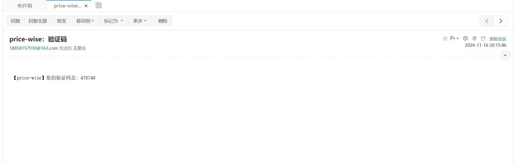
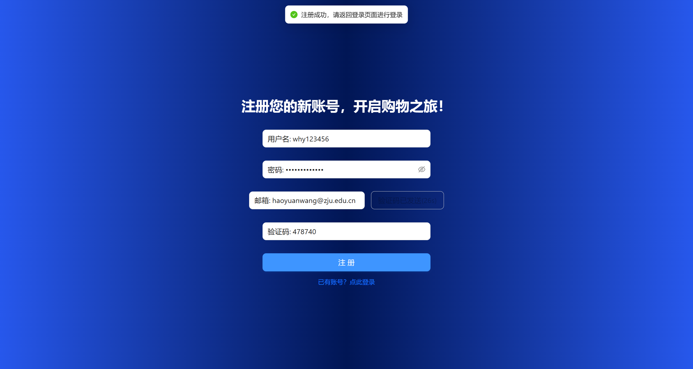
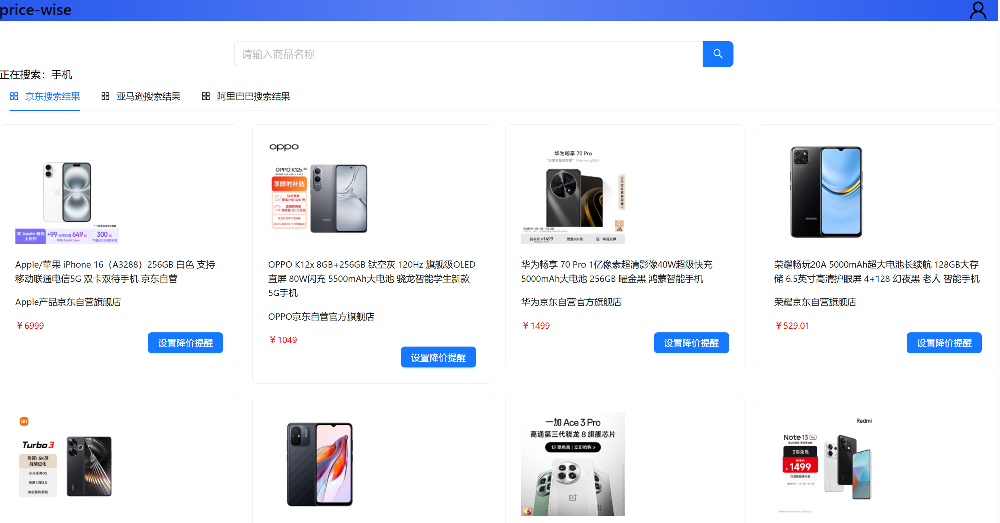

## 商品价格比较网站-用户手册

### 1. 文档介绍与项目简介

#### 1.1 编写目的

本用户手册为商品比价网站的用户使用手册，目的在于介绍B/S 体系软件设计课程项目《商品比价网站》的各种功能与操作方法，指导用户使用该网站。

#### 1.2 读者对象

本报告预期参考人员包括软件客户、项目经理、系统维护人员等。

#### 1.3 项目说明

项目名称：pricewise(商品价格比较网站)
- 任务提出者：浙江大学 B/S 体系软件设计任课老师-胡晓军
- 开发者：浙江大学软件工程系学生-王昊元
- 用户群：一般消费者、市场分析人员、自营电商等

这个项目是一个商品价格比较平台的网站开发，使用Web技术实现以下功能：
- 用户注册、登录功能，用户注册时需要填写必要的信息并验证，如用户名、密码要求在6字节以上，email的格式验证，并保证用户名和email在系统中唯一，用户登录后可以进行相应操作。
- 通过输入商品名称，可以搜索相关电商平台（京东、亚马逊、阿里巴巴）上相关商品的实时价格。
- 提供商品详细信息界面能显示商品信息，把历史价格用图表形式显示。
- 支持设置降价提醒，可以针对指定商品设置降价提醒，当商品价格低于上次获取的价格时，会通过邮件的方式给用户发送提醒。
- 样式适配手机，能够在手机浏览器中友好显示。

### 2. 安装和配置指南

### 3. 功能说明

#### 3.1 注册账号

用户进入网站后会首先开到登录页面，这时点击下方的“注册新账户”按钮跳转到注册页面：

根据提示填入对应信息，请注意用户名和密码都必须大于6位；邮箱必须输入正确的格式：

在输入正确且有效的邮箱格式后，点击“发送验证码”按钮，可以在对应邮箱中收到发送的6位验证码：

输入对应的验证码后，点击“注册”按钮完成注册：

注册成功后，会自动跳转回登录页面，并提示登录成功。

> 请注意：每个用户与邮箱唯一绑定。

#### 3.2 重置密码

如果忘记密码，可以在登录页面点击“忘记密码？”按钮，通过账户和邮箱进行密码重置：

输入希望重置密码的账户和邮箱，点击“发送验证码”按钮，会收到验证码：

输入正确的验证码，并输入在【新密码】和【确认密码】输入框中输入新的密码，注意两次密码输入必须一致：

点击“提交”按钮，会自动跳转到登录页面，并提示密码重置成功：

#### 3.3 登录

在登录页面，输入正确的账户与密码，点击“登录”按钮，如果账户和密码正确，会跳转到首页：

#### 3.4 登出

在登录后的任意页面（首页、展示页、详情页等），点击右上角的图标，会出现下拉框：

点击“退出登录”按钮，会弹出【确认退出登录】进行登出操作：

点击“确认”按钮，即可完成登出，并跳转到登录页面：

#### 3.5 搜索商品

在首页或展示页的搜索框中输入商品名称，并按回车或点击搜索按钮，会跳转到展示页（或在展示页中）展示搜索结果（手册中以【手机】为例）：

跳转至展示页后，在获取商品信息成功前，会显示【正在加载中，请稍后】的提示：

稍后约【10-20】秒后，会展示出商品信息：

点击二级菜单中的不同按钮：【京东搜索结果】、【亚马逊搜索结果】、【阿里巴巴搜索结果】，可在不同的搜索结果展示页之间切换：

#### 3.6 查询商品详情

在【搜索商品】操作成功后，点击希望查询详情的商品卡片区域，可以跳转到对应的详情页面：

在其中可以看到商品的具体信息，如商品名称、商品最新价格、商品来源平台、商品提供商家（如果平台提供相应信息）等。并且，可以看到商品近期的价格走势图：

在商品详情页面，点击左上角的`<`按钮，可以退回到搜索页面：

#### 3.7 设置降价提醒

在【搜索商品】页面点击目标商品卡片对应的【设置降价提醒】按钮，会弹出【确认设置降价提醒】的弹窗：

点击“OK”按钮后，可以完成降价提醒的设置：

设置成功后，系统会定时对您关注的商品进行信息获取与更新，如有降价，会通过您注册使用的邮箱向您发送降价提醒的邮件：

#### 3.8 查看/取消降价提醒设置

在登入后的任意页面点击右上角的图标，会出现下拉框：

点击其中“我的关注”按钮，会跳转到【我的关注】页面：

在该页面中可以看到当前关注的商品列表，点击列表【操作】列的【取消关注】按钮，可以取消该商品的降价提醒设置：

### 4. 移动端适配

### 5. 联系方式

在使用过程中如遇到难以解决的任何技术问题，请及时联系开发人员（王同学）：

- 邮箱：haoyuanwang@zju.edu.cn
- 电话：18858157930
- 地址：浙江大学玉泉校区